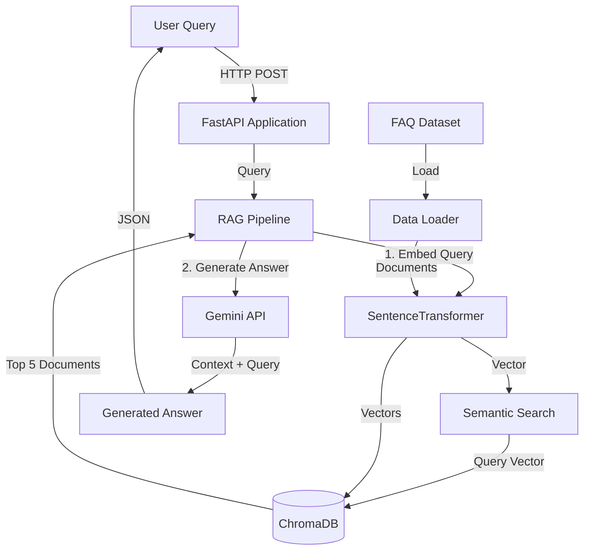

# RAG-based E-commerce Chatbot

An intelligent chatbot system built using **Retrieval Augmented Generation (RAG)** architecture for answering e-commerce FAQ questions. The system combines semantic search with large language models to provide accurate, context-aware responses.

## 📋 Table of Contents

- [Project Overview](#project-overview)
- [Architecture](#architecture)
- [Technology Stack](#technology-stack)
- [Features](#features)
- [Project Structure](#project-structure)
- [Installation](#installation)
- [Usage](#usage)
- [API Endpoints](#api-endpoints)
- [Dataset](#dataset)
- [Configuration](#configuration)
- [Docker Deployment](#docker-deployment)
- [Development](#development)
- [Troubleshooting](#troubleshooting)

## 🎯 Project Overview

This project implements a RAG-based chatbot specifically designed for e-commerce customer service. It uses:

- **Vector Database (ChromaDB)** to store and retrieve FAQ documents
- **Semantic Search** using SentenceTransformers embeddings
- **LLM (Gemini)** for generating natural, context-aware responses
- **FastAPI** for a robust REST API interface

The chatbot ensures responses are grounded in the knowledge base, preventing hallucinations and maintaining accuracy.

## 🏗️ Architecture



### RAG Pipeline Flow

1. **User Query** → Received via REST API
2. **Embedding** → Query converted to vector using SentenceTransformer
3. **Retrieval** → Top 5 most relevant FAQ documents retrieved from ChromaDB
4. **Generation** → Gemini LLM generates answer based on retrieved context
5. **Response** → Structured JSON response with query, documents, and answer

## 🛠️ Technology Stack

| Component | Technology | Purpose |
|-----------|-----------|---------|
| **Web Framework** | FastAPI | REST API server |
| **Vector Database** | ChromaDB | Document storage and retrieval |
| **Embeddings** | SentenceTransformers | Text-to-vector conversion |
| **LLM** | Google Gemini API | Answer generation |
| **Data Processing** | Pandas | Dataset handling |
| **Containerization** | Docker & Docker Compose | Deployment |

## ✨ Features

- ✅ **Semantic Search**: Find relevant FAQs using meaning, not just keywords
- ✅ **Context-Aware Responses**: Generate answers based on retrieved documents
- ✅ **No Hallucination**: Responses strictly grounded in knowledge base
- ✅ **REST API**: Easy integration with any frontend
- ✅ **Persistent Storage**: ChromaDB data persists across restarts
- ✅ **Docker Support**: One-command deployment
- ✅ **Interactive Documentation**: Swagger UI at `/docs`
- ✅ **Health Monitoring**: Built-in health checks

## 📁 Project Structure

```
chatbot/
├── app/
│   ├── __init__.py              # App version info
│   ├── main.py                  # FastAPI application entry point
│   ├── config.py                # Configuration management
│   ├── models.py                # Pydantic models for API
│   ├── rag/
│   │   ├── __init__.py
│   │   ├── data_loader.py       # Load and format FAQ dataset
│   │   ├── embeddings.py        # SentenceTransformer wrapper
│   │   ├── vector_store.py      # ChromaDB operations
│   │   ├── retriever.py         # Document retrieval logic
│   │   └── generator.py         # Gemini API integration
│   └── api/
│       ├── __init__.py
│       └── routes.py            # API endpoint definitions
├── data/
│   └── Ecommerce_FAQ_Chatbot_dataset.csv  # FAQ dataset
├── chroma_db/                   # ChromaDB persistence (auto-created)
├── requirements.txt             # Python dependencies
├── Dockerfile                   # Docker image definition
├── docker-compose.yml           # Docker Compose configuration
├── .env.example                 # Environment variables template
├── .gitignore                   # Git ignore patterns
└── README.md                    # This file
```

## 🚀 Installation

### Prerequisites

- Python 3.11+
- Docker & Docker Compose (for containerized deployment)
- Gemini API key ([Get one here](https://makersuite.google.com/app/apikey))

### Local Installation

1. **Clone the repository**
   ```bash
   cd c:\Users\hkiri\Desktop\oussema\chatbot
   ```

2. **Create virtual environment**
   ```bash
   python -m venv venv
   venv\Scripts\activate  # Windows
   ```

3. **Install dependencies**
   ```bash
   pip install -r requirements.txt
   ```

4. **Configure environment**
   ```bash
   copy .env.example .env
   ```
   
   Edit `.env` and add your Gemini API key:
   ```
   GEMINI_API_KEY=your_actual_api_key_here
   ```

5. **Add dataset**
   
   Download the [Ecommerce FAQ Chatbot Dataset](https://www.kaggle.com/datasets/saadmakhdoom/ecommerce-faq-chatbot-dataset) from Kaggle and place it in the `data/` folder as `Ecommerce_FAQ_Chatbot_dataset.csv`.

## 💻 Usage

### Running Locally

```bash
# Activate virtual environment
venv\Scripts\activate

# Run the application
python -m uvicorn app.main:app --reload --host 0.0.0.0 --port 8000
```

The API will be available at:
- **API**: http://localhost:8000
- **Swagger UI**: http://localhost:8000/docs
- **ReDoc**: http://localhost:8000/redoc

### First Run

On the first run, the application will:
1. Load the FAQ dataset
2. Generate embeddings for all documents
3. Populate ChromaDB with vectors
4. Initialize the retriever and generator

This process may take a few minutes depending on dataset size.

## 📡 API Endpoints

### 1. Health Check

**GET** `/`

Returns API version and documentation URL.

**Response:**
```json
{
  "version": "1.0.0",
  "swagger": "/docs"
}
```

### 2. Search Documents

**POST** `/search`

Retrieve top 5 most relevant documents for a query.

**Request:**
```json
{
  "query": "What payment methods do you accept?"
}
```

**Response:**
```json
{
  "query": "What payment methods do you accept?",
  "top_documents": [
    {
      "content": "Question: What payment methods do you accept?\nResponse: We accept credit cards, PayPal, and bank transfers.",
      "score": 0.95
    },
    ...
  ]
}
```

### 3. Chat (Complete RAG Pipeline)

**POST** `/chat`

Retrieve documents and generate an answer.

**Request:**
```json
{
  "query": "How long does shipping take?"
}
```

**Response:**
```json
{
  "query": "How long does shipping take?",
  "top_documents": [
    {
      "content": "Question: How long does shipping take?\nResponse: Standard shipping takes 3-5 business days.",
      "score": 0.92
    },
    ...
  ],
  "response": "Standard shipping typically takes 3-5 business days. We also offer express shipping options for faster delivery."
}
```

### 4. System Statistics

**GET** `/stats`

Get vector database statistics.

**Response:**
```json
{
  "collection_name": "ecommerce_faq",
  "document_count": 500,
  "persist_directory": "./chroma_db"
}
```

## 📊 Dataset

This project uses the **Ecommerce FAQ Chatbot Dataset** from Kaggle.

- **Source**: [Kaggle - Ecommerce FAQ Chatbot Dataset](https://www.kaggle.com/datasets/saadmakhdoom/ecommerce-faq-chatbot-dataset)
- **Format**: CSV with question-answer pairs
- **Size**: ~500 FAQ entries
- **Topics**: Shipping, returns, payments, product info, etc.

### Dataset Format

The loader automatically detects columns containing:
- Questions: `question`, `query`, `q`
- Answers: `answer`, `response`, `a`

Documents are formatted as:
```
Question: [question text]
Response: [answer text]
```

## ⚙️ Configuration

Configuration is managed via environment variables in `.env`:

| Variable | Description | Default |
|----------|-------------|---------|
| `GEMINI_API_KEY` | Google Gemini API key | *Required* |
| `EMBEDDING_MODEL` | SentenceTransformer model | `all-MiniLM-L6-v2` |
| `GEMINI_MODEL` | Gemini model name | `gemini-pro` |
| `CHROMA_DB_PATH` | ChromaDB storage path | `./chroma_db` |
| `COLLECTION_NAME` | ChromaDB collection name | `ecommerce_faq` |
| `DATASET_PATH` | Path to CSV dataset | `./data/Ecommerce_FAQ_Chatbot_dataset.csv` |
| `TOP_K` | Number of documents to retrieve | `5` |

## 🐳 Docker Deployment

### Using Docker Compose (Recommended)

1. **Configure environment**
   ```bash
   copy .env.example .env
   ```
   Edit `.env` and add your Gemini API key.

2. **Build and run**
   ```bash
   docker-compose up --build
   ```

3. **Access the API**
   - API: http://localhost:8000
   - Swagger: http://localhost:8000/docs

4. **Stop the application**
   ```bash
   docker-compose down
   ```

5. **Reset data (if needed)**
   ```bash
   docker-compose down -v  # Removes volumes
   ```

### Using Docker Directly

```bash
# Build image
docker build -t rag-chatbot .

# Run container
docker run -d \
  -p 8000:8000 \
  -e GEMINI_API_KEY=your_key_here \
  -v chroma_data:/app/chroma_db \
  --name rag-chatbot \
  rag-chatbot
```

### Data Persistence

ChromaDB data is stored in a Docker volume (`chroma_data`), ensuring:
- Data persists across container restarts
- No need to re-embed documents on restart
- Fast startup after initial setup

## 🔧 Development

### Running Tests

```bash
# Install dev dependencies
pip install pytest httpx

# Run tests (if test suite exists)
pytest
```

### Code Structure

- **`app/main.py`**: Application entry point with lifespan management
- **`app/config.py`**: Centralized configuration using Pydantic
- **`app/models.py`**: Request/response models with validation
- **`app/rag/`**: Core RAG pipeline components
- **`app/api/`**: API route definitions

### Adding New Features

1. Update models in `app/models.py`
2. Add business logic in `app/rag/`
3. Create endpoints in `app/api/routes.py`
4. Update documentation in this README

## 🐛 Troubleshooting

### Issue: "Gemini API key is required"

**Solution**: Ensure `.env` file exists and contains:
```
GEMINI_API_KEY=your_actual_key_here
```

### Issue: "Dataset not found"

**Solution**: Download the dataset from Kaggle and place it in `data/Ecommerce_FAQ_Chatbot_dataset.csv`

### Issue: ChromaDB errors on Windows

**Solution**: Ensure you have the latest Visual C++ Redistributable installed.

### Issue: Slow first startup

**Solution**: This is normal. The first run:
- Downloads the embedding model (~80MB)
- Generates embeddings for all documents
- Populates ChromaDB

Subsequent runs are much faster as data is persisted.

### Issue: Port 8000 already in use

**Solution**: Change the port in `docker-compose.yml`:
```yaml
ports:
  - "8001:8000"  # Use port 8001 instead
```

## 📝 License

This project is for academic purposes.

## 🙏 Acknowledgments

- **Dataset**: Saad Makhdoom (Kaggle)
- **Embeddings**: SentenceTransformers library
- **Vector DB**: ChromaDB
- **LLM**: Google Gemini API
- **Framework**: FastAPI

---

**Project**: Chatbot Intelligent basé sur RAG (Retrieval Augmented Generation)  
**Author**: Academic Project  
**Version**: 1.0.0
